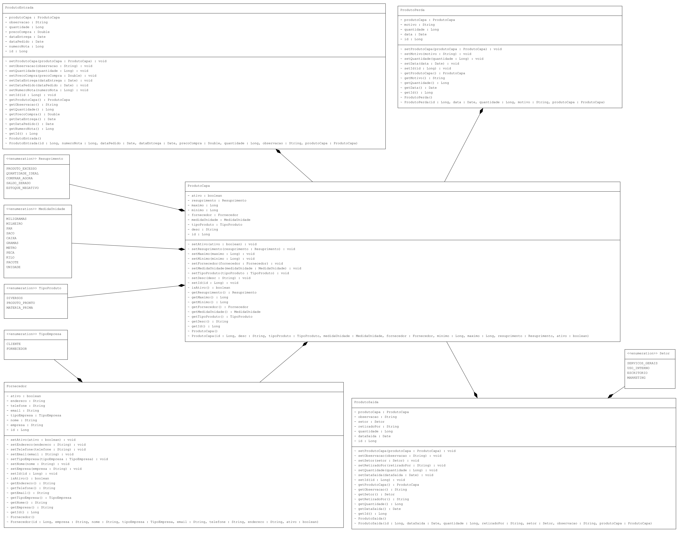

# Sumário

1. [Introdução](#introdução)
2. [Diagrama de Classe](#diagrama-de-classe)
3. [Classes Principais](#classes-principais)
    - [Fornecedor](#fornecedor)
    - [ProdutoCapa](#produtocapa)
    - [ProdutoEntrada](#produtoentrada)
    - [ProdutoPerda](#produtoperda)
    - [ProdutoSaidaPostDTO](#produtosaidapostdto)
4. [Requisitos Funcionais](#requisitos-funcionais)
    - [RF1: Cadastro de Fornecedor](#rf1-cadastro-de-fornecedor)
    - [RF2: Cadastro de Produto](#rf2-cadastro-de-produto)
    - [RF3: Registro de Entrada de Produtos](#rf3-registro-de-entrada-de-produtos)
    - [RF4: Registro de Perda de Produtos](#rf4-registro-de-perda-de-produtos)
    - [RF5: Registro de Saída de Produtos](#rf5-registro-de-saída-de-produtos)
5. [Requisitos Não Funcionais](#requisitos-não-funcionais)
6. [Regras de Negócio](#regras-de-negócio)
    - [RN1: Ativação de Fornecedor](#rn1-ativação-de-fornecedor)
    - [RN2: Controle de Estoque](#rn2-controle-de-estoque)
    - [RN3: Registro de Saída](#rn3-registro-de-saída)
    - [RN4: Histórico de Transações](#rn4-histórico-de-transações)

# Projeto Estoque - Documentação
Este é um projeto estoque que lida com produtos. Abaixo estão algumas das classes principais do projeto:

## Diagrama de classe

   

## Classes Principais
### Fornecedor
Esta classe representa um fornecedor e possui os seguintes atributos:

- id: Um identificador único para o fornecedor.
- empresa: Nome da empresa fornecedora.
- nome: Nome do fornecedor.
- tipoEmpresa: Tipo de empresa.
- email: Endereço de e-mail do fornecedor.
- telefone: Número de telefone do fornecedor.
- endereco: Endereço do fornecedor.
- ativo: Indica se o fornecedor está ativo.

### ProdutoCapa
Esta classe representa um produto e possui os seguintes atributos:

- desc: Descrição do produto.
- tipoProduto: Tipo de produto.
- medidaUnidade: Unidade de medida.
- fornecedor: Fornecedor do produto.
- minimo: Quantidade mínima do produto.
- maximo: Quantidade máxima do produto.
- ativo: Indica se o produto está ativo.

### ProdutoEntrada
Esta classe representa a entrada de um produto e possui os seguintes atributos:

- numeroNota: Número da nota fiscal.
- dataPedido: Data do pedido.
- dataEntrega: Data de entrega.
- precoCompra: Preço de compra do produto.
- quantidade: Quantidade do produto.
- observacao: Observações sobre a entrada.
- produtoCapa: Informações sobre a capa do produto.

### ProdutoPerda
Esta classe representa a perda de um produto e possui os seguintes atributos:

- data: Data da perda (padrão é a data atual).
- quantidade: Quantidade perdida.
- motivo: Motivo da perda.
- produtoCapa: Informações sobre a capa do produto.

### ProdutoSaidaPostDTO
Esta classe representa a saída de um produto e possui os seguintes atributos:

- dataSaida: Data da saída (padrão é a data atual).
- quantidade: Quantidade de produtos retirados.
- retiradoPor: Nome da pessoa que retirou o produto.
- setor: Setor responsável pela saída.
- observacao: Observações sobre a saída.
- produtoCapa: Informações sobre a capa do produto.

## Requisitos Funcionais

- **RF1: Cadastro de Fornecedor**
  O sistema deve permitir o cadastro de fornecedores com informações como empresa, nome, tipo de empresa, email, telefone e endereço.

- **RF2: Cadastro de Produto**
  O sistema deve permitir o cadastro de produtos com informações como descrição, tipo de produto, unidade de medida, fornecedor, quantidade mínima e máxima.

- **RF3: Registro de Entrada de Produtos**
  O sistema deve permitir o registro da entrada de produtos com informações como número da nota fiscal, data do pedido, data de entrega, preço de compra, quantidade e observações.

- **RF4: Registro de Perda de Produtos**
  O sistema deve permitir o registro de perda de produtos com informações como data da perda, quantidade perdida e motivo da perda.

- **RF5: Registro de Saída de Produtos**
  O sistema deve permitir o registro de saída de produtos com informações como data da saída, quantidade retirada, responsável pela retirada, setor responsável e observações.

## Requisitos Não Funcionais

- Desenvolvido em Java.
- Spring Boot Framework.
- Cobertura mínima de código de 50%(testes unitários).
- Banco de Dados em Postgres.
- Documentação das API’s no Swagger.
- Maven para gerenciamento das dependências do projeto.
- Flyway para gerenciamento dos migrations do projeto.
- Deploy da aplicação no Railway.

## Regras de Negócio

- **RN1: Ativação de Fornecedor**
  Um fornecedor pode estar ativo ou inativo. A ativação/inativação de um fornecedor deve ser controlada pelo sistema.

- **RN2: Controle de Estoque**
  O sistema deve manter um controle de estoque e alertar quando a quantidade de um produto estiver abaixo do mínimo especificado.

- **RN3: Registro de Saída**
  O sistema não deve permitir a saída de produtos se a quantidade disponível for menor do que a quantidade a ser retirada.

- **RN4: Histórico de Transações**
  O sistema deve manter um histórico de todas as transações, incluindo entradas, perdas e saídas de produtos.
